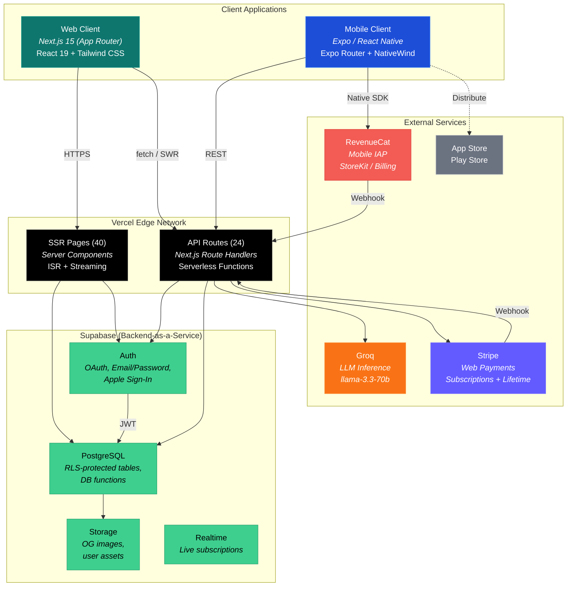
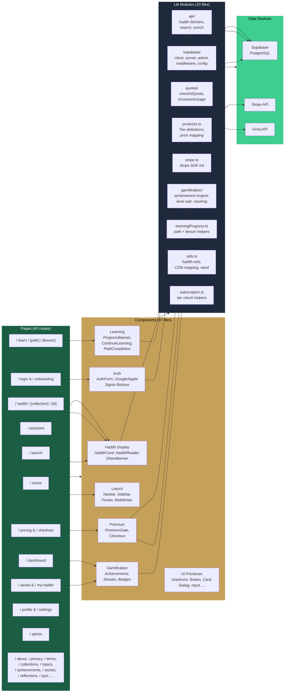
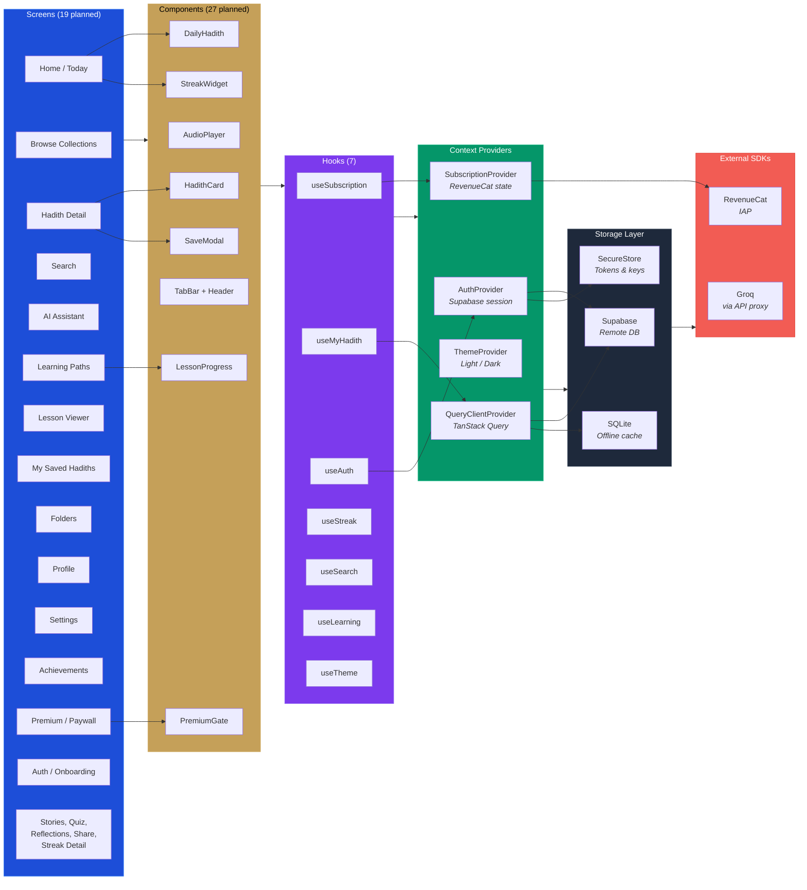
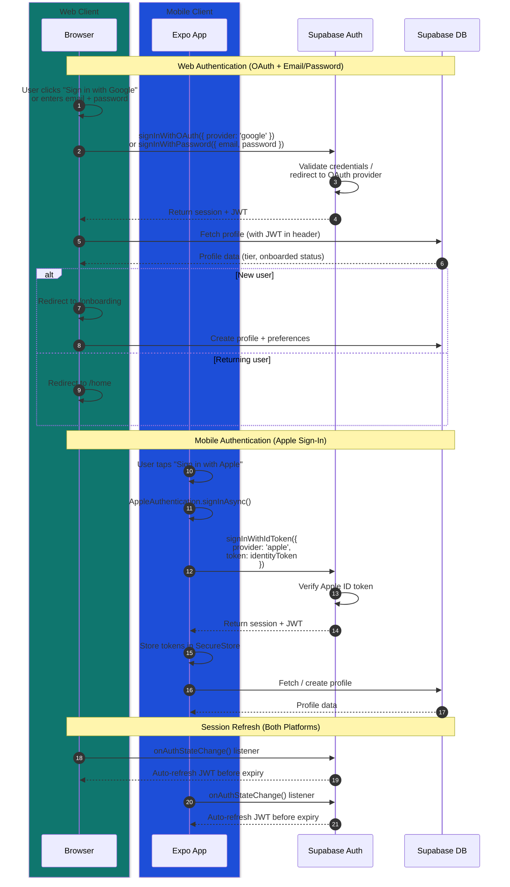
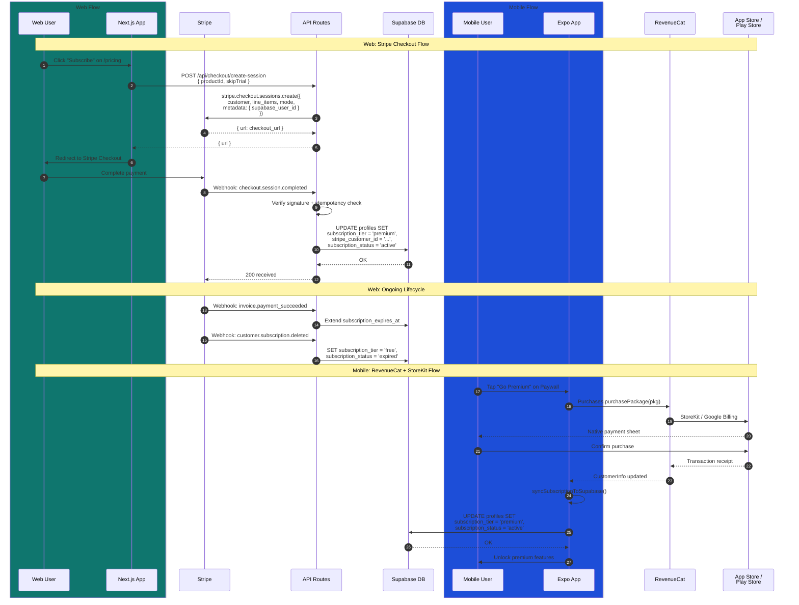
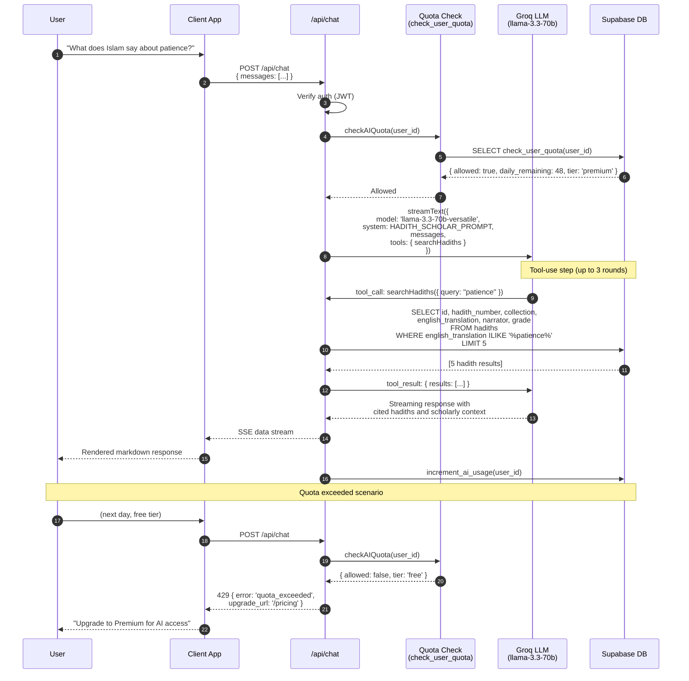
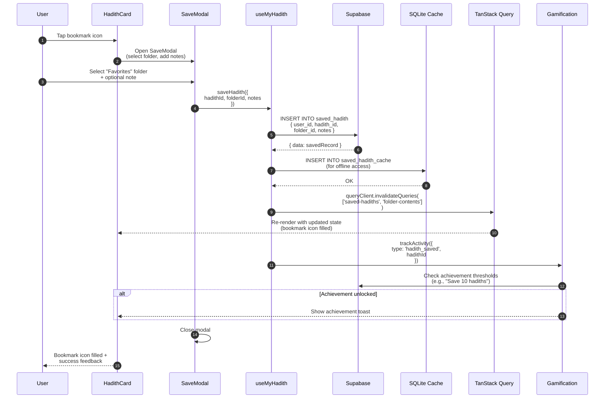
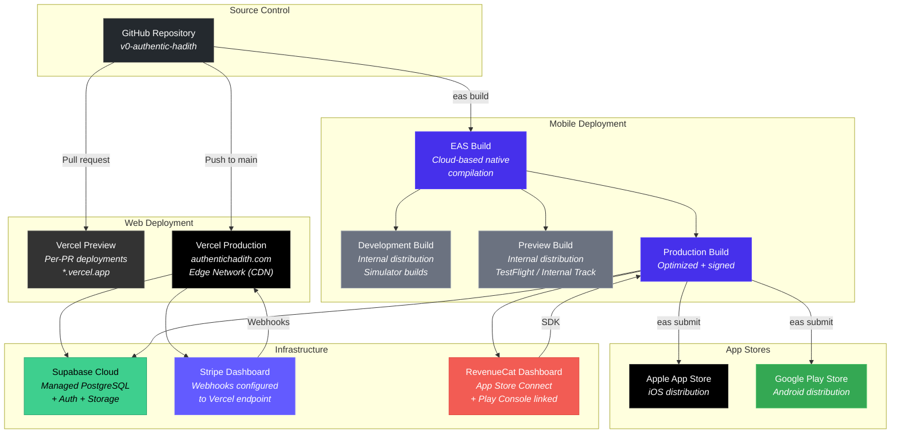

# Authentic Hadith -- Architecture Overview

> A cross-platform Islamic hadith study platform serving 31,839+ authenticated hadiths from the eight major collections, with AI-powered search, gamified learning paths, and premium subscriptions.

---

## Table of Contents

1. [High-Level System Architecture](#1-high-level-system-architecture)
2. [Web Application Component Diagram](#2-web-application-component-diagram)
3. [Mobile Application Component Diagram](#3-mobile-application-component-diagram)
4. [Database Schema (Entity Relationship)](#4-database-schema-entity-relationship)
5. [Authentication Flow](#5-authentication-flow)
6. [Subscription Flow](#6-subscription-flow)
7. [AI Chat Flow](#7-ai-chat-flow)
8. [Data Flow: Save Hadith (Mobile)](#8-data-flow-save-hadith-mobile)
9. [Deployment Architecture](#9-deployment-architecture)
10. [Feature Matrix](#10-feature-matrix)

---

## 1. High-Level System Architecture

The platform follows a C4 Context-style architecture with two client applications (web and mobile), a shared backend on Vercel, a Supabase data layer, and integrations with Stripe, RevenueCat, and Groq for payments and AI.

---

## 2. Web Application Component Diagram

The Next.js web application is organized into four layers: pages, components, library modules, and external data sources. Data flows left-to-right from user-facing pages through shared components into the lib layer, which communicates with Supabase and third-party APIs.

---

## 3. Mobile Application Component Diagram

The Expo/React Native mobile app uses a similar layered architecture. It communicates with Supabase directly for data and uses RevenueCat for in-app purchases. Offline-capable caching uses SQLite and SecureStore.

---

## 4. Database Schema (Entity Relationship)

The PostgreSQL schema is organized around four domains: hadith content, user data, subscriptions/billing, and learning paths. All user-owned tables are protected by Row Level Security (RLS) policies.

```mermaid
erDiagram
    hadiths {
        uuid id PK
        text arabic_text
        text english_translation
        text collection
        int book_number
        int hadith_number
        text reference
        text grade
        text narrator
        bool is_featured
        timestamptz created_at
    }

    collections {
        uuid id PK
        text name_en
        text name_ar
        text slug UK
        text scholar
        int total_hadiths
        bool is_featured
        jsonb grade_distribution
    }

    collection_hadiths {
        uuid id PK
        uuid collection_id FK
        uuid hadith_id FK
        int book_id FK
        uuid chapter_id FK
        int hadith_number
    }

    chapters {
        uuid id PK
        int book_id FK
        int number
        text name_en
        text name_ar
    }

    topics {
        uuid id PK
        text name_en UK
        text name_ar
    }

    hadith_topics {
        uuid hadith_id FK
        uuid topic_id FK
    }

    profiles {
        uuid id PK
        uuid user_id FK
        text email
        text full_name
        text subscription_tier
        text subscription_status
        text stripe_customer_id UK
        text stripe_subscription_id UK
        timestamptz subscription_started_at
        timestamptz subscription_expires_at
    }

    saved_hadith {
        uuid id PK
        uuid user_id FK
        uuid hadith_id FK
        uuid folder_id FK
        text notes
        timestamptz saved_at
    }

    user_folders {
        uuid id PK
        uuid user_id FK
        text name
        text color
        int sort_order
    }

    user_streaks {
        uuid id PK
        uuid user_id FK
        int current_streak
        int longest_streak
        date last_active_date
        int total_days_active
    }

    user_usage {
        uuid user_id PK
        int ai_queries_today
        int ai_queries_this_month
        int saved_hadith_count
        date last_daily_reset
    }

    tier_quotas {
        text tier PK
        int ai_queries_per_day
        int ai_queries_per_month
        int saved_hadith_limit
        bool can_use_advanced_search
        bool can_use_semantic_search
    }

    stripe_events {
        uuid id PK
        text stripe_event_id UK
        text event_type
        jsonb payload
    }

    learning_paths {
        uuid id PK
        text slug UK
        text title
        text description
        text level
        bool is_premium
        int sort_order
    }

    learning_path_lessons {
        uuid id PK
        uuid path_id FK
        text module_id
        text module_title
        text slug
        text title
        int order_index
        text content_type
        text collection_slug
        int hadith_count
        int estimated_minutes
    }

    user_learning_path_progress {
        uuid id PK
        uuid user_id FK
        uuid path_id FK
        text status
        timestamptz started_at
        timestamptz completed_at
        uuid last_lesson_id FK
    }

    user_lesson_progress {
        uuid id PK
        uuid user_id FK
        uuid path_id FK
        uuid lesson_id FK
        text state
        int progress_percent
        timestamptz completed_at
    }

    learning_events {
        uuid id PK
        uuid user_id FK
        text event_type
        jsonb payload
        timestamptz created_at
    }

    user_lesson_notes {
        uuid id PK
        uuid user_id FK
        uuid lesson_id FK
        uuid path_id FK
        text note_text
    }

    saved_collections {
        uuid id PK
        uuid user_id FK
        uuid collection_id FK
    }

    hadiths ||--o{ collection_hadiths : "appears in"
    collections ||--o{ collection_hadiths : "contains"
    hadiths ||--o{ hadith_topics : "tagged with"
    topics ||--o{ hadith_topics : "classifies"
    chapters }o--|| collections : "belongs to"

    profiles ||--o{ saved_hadith : "bookmarks"
    profiles ||--o{ user_folders : "organizes into"
    profiles ||--o{ user_streaks : "tracks streak"
    profiles ||--o{ user_usage : "tracks quota"
    profiles ||--o{ saved_collections : "follows"

    learning_paths ||--o{ learning_path_lessons : "contains"
    profiles ||--o{ user_learning_path_progress : "enrolls in"
    learning_paths ||--o{ user_learning_path_progress : "progress for"
    learning_path_lessons ||--o{ user_lesson_progress : "tracks"
    profiles ||--o{ user_lesson_progress : "completes"
    profiles ||--o{ learning_events : "generates"
    profiles ||--o{ user_lesson_notes : "writes"

    tier_quotas ||--o{ profiles : "governs"
```

---

## 5. Authentication Flow

Authentication supports two paths: OAuth/email on the web and Apple Sign-In on mobile. Both converge on Supabase Auth, which issues JWTs used for all subsequent API calls.

---

## 6. Subscription Flow

Subscriptions are handled through Stripe on the web and RevenueCat on mobile. Both flows ultimately write the subscription tier to the `profiles` table in Supabase, ensuring a single source of truth.

---

## 7. AI Chat Flow

The AI assistant uses Groq (llama-3.3-70b-versatile) with tool-use capabilities. The LLM can call `searchHadiths` to query the database mid-conversation, enabling grounded responses backed by authentic sources.

---

## 8. Data Flow: Save Hadith (Mobile)

When a mobile user saves a hadith, the app writes to Supabase, caches locally in SQLite for offline access, invalidates TanStack Query caches, and triggers a gamification event.

---

## 9. Deployment Architecture

The web app deploys to Vercel via GitHub integration with preview deployments on every PR. The mobile app uses EAS Build for native binary compilation and EAS Submit for store distribution.

---

## 10. Feature Matrix

The table below maps every major feature to its supporting platform(s) and backend dependencies.

| Feature | Web | Mobile | Backend |
|---|---|---|---|
| **Hadith Browsing** | 40 pages with SSR + ISR | Native scroll views | Supabase (hadiths, collections, chapters) |
| **Full-text Search** | `/search` page with filters | Search screen with debounce | Supabase ILIKE queries |
| **AI Chat Assistant** | `/assistant` with streaming UI | Chat screen (via API proxy) | Groq llama-3.3-70b + tool-use |
| **Daily Hadith** | `/today` page | Home screen widget | `/api/daily-hadith` route |
| **Save / Bookmark** | Save to folders via modal | Save modal + SQLite offline cache | `saved_hadith` + `user_folders` tables |
| **Learning Paths** | `/learn/[path]/[lesson]` (4 paths, 26 lessons) | Learning tab with progress | `learning_paths` + `learning_path_lessons` |
| **Lesson Progress** | Progress bar + completion tracking | State-synced progress | `user_lesson_progress` + `user_learning_path_progress` |
| **Lesson Notes** | In-lesson note-taking | Planned | `user_lesson_notes` table |
| **Gamification / Streaks** | Dashboard streak widget + achievements | Streak widget + badge display | `user_streaks` + `user_stats` tables |
| **Achievements** | `/achievements` page | Achievements screen | `gamification/achievement-engine.ts` |
| **User Profile** | `/profile` + `/settings` | Profile + Settings screens | `profiles` table |
| **OAuth Login** | Google + Email/Password | Apple Sign-In | Supabase Auth |
| **Subscription (Premium)** | Stripe Checkout (monthly, yearly, lifetime) | RevenueCat IAP | `profiles.subscription_tier` |
| **Quota Enforcement** | Server-side per-request check | Server-side per-request check | `user_usage` + `tier_quotas` + DB functions |
| **Hadith Enrichment** | `/api/enrich` + admin review | -- | Groq AI + `hadith_enrichment` |
| **Social Sharing** | OG image generation + share links | Native share sheet | `/api/og/hadith` + `/api/share` |
| **Collections Browser** | `/collections` with detail pages | Collections screen | `collections` + `collection_hadiths` |
| **Sahaba Stories** | `/stories` pages | Stories screen | Content in DB |
| **Reflections** | `/reflections` journal | Planned | Supabase table |
| **Quiz** | `/quiz` interactive | Planned | Content-driven |
| **Onboarding** | `/onboarding` multi-step flow | Onboarding screens | `user_preferences.onboarded` |
| **Account Deletion** | `/settings` with confirmation | Settings screen | `delete_user_account()` DB function + archive |
| **Admin Panel** | `/admin` (role-gated) | -- | Server-only |
| **Offline Access** | Service Worker (PWA planned) | SQLite cache + SecureStore | -- |
| **Dark Mode** | Tailwind `dark:` classes | NativeWind theme | `user_settings` |
| **Internationalization** | Arabic text display (RTL) | Arabic text display (RTL) | `arabic_text` column on hadiths |

---

## Key Technology Choices

| Layer | Technology | Rationale |
|---|---|---|
| Web Framework | Next.js 15 (App Router) | Server Components, streaming SSR, API routes in one framework |
| Mobile Framework | Expo (React Native) | Shared JS ecosystem with web, EAS Build for native compilation |
| Database | Supabase (PostgreSQL) | RLS for multi-tenant security, real-time subscriptions, built-in Auth |
| AI / LLM | Groq (llama-3.3-70b) | Sub-second inference latency, tool-use support, cost-effective |
| Web Payments | Stripe | Industry standard, webhook-driven lifecycle, support for subscriptions + one-time |
| Mobile Payments | RevenueCat | Abstracts StoreKit/Billing, handles receipt validation, syncs across platforms |
| Styling (Web) | Tailwind CSS + shadcn/ui | Utility-first with accessible component primitives |
| Styling (Mobile) | NativeWind | Tailwind syntax for React Native, consistent with web |
| State / Cache | TanStack Query | Declarative caching, background refetch, optimistic updates |
| Deployment (Web) | Vercel | Zero-config Next.js hosting, edge CDN, preview deployments |
| Deployment (Mobile) | EAS Build + Submit | Cloud-native iOS/Android builds, OTA updates via expo-updates |
